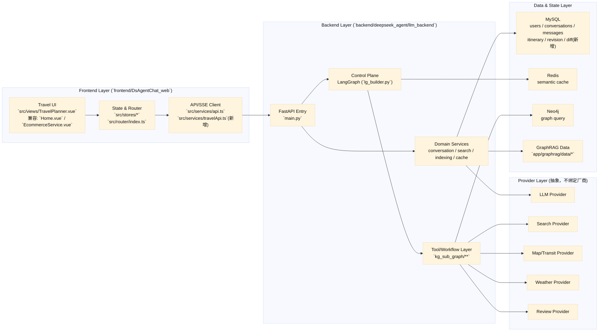
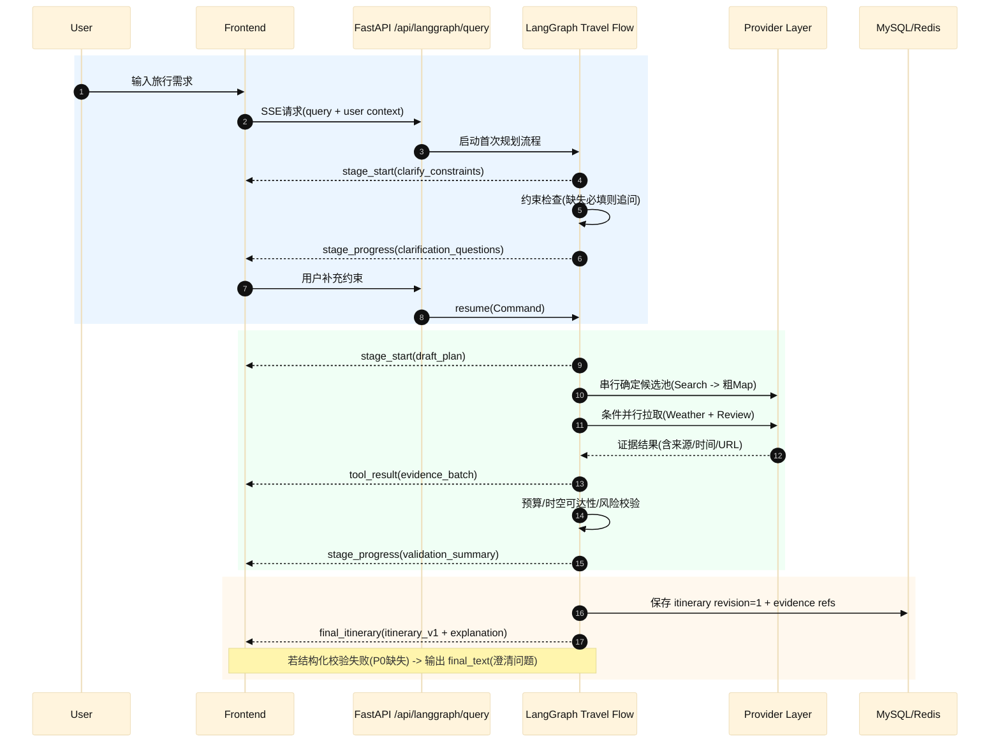
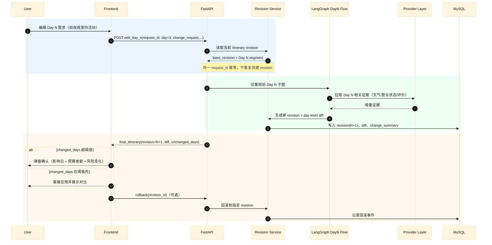
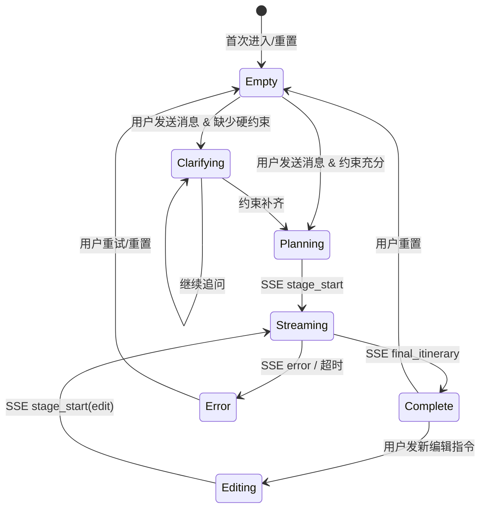

# TravelMind 工程设计文档 v1.1（基于现有仓库最小改造）

## 1) 核心目标

### 1.1 系统目标
- 将现有智能客服/电商智能体改造为「旅行规划智能体 TravelMind」。
- 保持前后端分离架构，前端负责可视化与交互，后端负责编排、检索、证据聚合、结构化输出。
- 输出可编辑的结构化行程（`itinerary v1`），支持多轮对话驱动的连续优化（含 Edit Day N）。
- 输出真实证据用于推荐解释（只读证据），不做交易闭环。
- 保持流式交互，支持阶段化反馈（可见进度、可见风险、可见证据）。

### 1.2 MVP 边界
- 支持：首次生成、Edit Day N、证据展示、JSON/Markdown 导出。
- 支持：预算分项、风险分级、备选项、修订链与 diff。
- 支持：标准检索模式（默认），满足常规旅行规划请求。
- 不支持：下单、支付、票务履约、库存锁定。
- 不默认启用：DeepResearch 深度研究模式（高成本/高时延，作为增强路径）。

### 1.3 非目标
- 不做 OTA 级实时承诺。
- 不做多人实时协作编辑。
- 不做复杂跨端离线冲突合并。

### 1.4 当前实现与目标态差距（v1.1 -> v1.2）

当前已实现（可用）：
- 可基于单次输入生成结构化行程草案；
- 可进行局部调整（以 Edit Day N 为核心）；
- 有 revision/diff 与 SSE 事件基础。

目标态（对齐 GPT/Mindtrip 风格）：
- 同一会话内连续修改，不切换到独立“编辑模式”；
- 每轮对话先识别意图（create/edit/qa/reset），再对当前行程做 patch；
- 返回 `new_revision + diff + explanation`，并在前端聊天区与行程区联动刷新。

设计取舍：
- 不推翻现有 LangGraph 主控与 `itinerary v1` 契约；
- 通过新增“会话态 + patch 编辑层 + 对话路由”渐进演进到目标态。
- 当前阶段不走“多智能体优先”主线：多智能体仅作为增强层灰度接入，避免并行状态写入与调试复杂度过高。

工程亮点（面向大厂落地）：
- 单控制面治理：状态真值唯一、可追踪、可回滚；
- 协议治理：SSE 统一 envelope + 兼容旧消费端；
- 演进治理：M2 打通核心体验，M3/M4 再引入增强能力，不阻塞交付。

---

## 2) 总体架构



架构图 SVG：`docs/diagrams/architecture-overview.svg`

**现状说明（与纯前后端分离部署差异）**  
当前 `main.py` 通过 `app.mount("/", StaticFiles(...))` 挂载前端静态资源，属于“分离开发、同服务托管发布”。MVP 保留兼容，后续补独立前端发布流水线。

**页面兼容说明（v1.1）**  
`src/views/EcommerceService.vue` 保留为迁移兼容页面，TravelMind 主工作台收敛至 `src/views/TravelPlanner.vue`。

### 2.1 控制面与状态源
- LangGraph 是唯一控制面（single control plane）。
- LangGraph 状态是唯一真值（source of truth）。
- DeepAgents 如使用，只能作为 LangGraph 节点执行器，输入输出必须回写 LangGraph 状态。
- 禁止并行控制面与旁路状态写入。

---

## 3) 模块划分（基于真实目录）

### 3.1 后端入口与 API
- `llm_backend/main.py`：统一路由、SSE 输出、会话接口、LangGraph 查询入口。
- `llm_backend/app/services/travel_clarification_service.py`：澄清门槛判定与追问状态管理（接口层与业务规则解耦）。

### 3.2 认证与用户
- `app/api/auth.py`、`app/core/security.py`、`app/services/user_service.py`：注册、登录、JWT。

### 3.3 会话与消息
- `app/services/conversation_service.py`、`app/models/conversation.py`、`app/models/message.py`：会话 CRUD、消息落库。

### 3.4 LLM 服务工厂
- `app/services/llm_factory.py`、`deepseek_service.py`、`ollama_service.py`：模型选择与流式输出。

### 3.5 搜索与工具调用
- `app/services/search_service.py`、`app/tools/*`、`app/services/function_tools.py`：function-calling + 检索摘要。

### 3.6 Agent 编排
- `app/lg_agent/lg_builder.py`、`app/lg_agent/lg_states.py`：路由与节点执行。

### 3.7 子图与检索
- `app/lg_agent/kg_sub_graph/**`：planner、tool_selection、cypher/graphrag、总结。

### 3.8 索引服务
- `app/services/indexing_service.py`：GraphRAG 索引构建、增量更新、用户隔离目录。

### 3.9 缓存
- `app/services/redis_semantic_cache.py`：语义缓存。

### 3.10 前端应用
- `frontend/DsAgentChat_web/src/views/*`、`src/services/api.ts`、`src/stores/*`：交互、SSE 解析、会话态。

---

## 4) 从现有项目基础上如何改造

### 4.1 可复用
- FastAPI 主干与鉴权体系（`main.py`、`auth.py`）。
- 会话存储能力（`conversation_service.py`）。
- LLM 工厂（`llm_factory.py`）。
- LangGraph 编排骨架（`lg_builder.py` + `kg_sub_graph/**`）。
- Redis 语义缓存（`redis_semantic_cache.py`）。

### 4.2 必须改变
- 电商语义迁移到旅行语义（prompt、tool schema、guardrails）。
- 终态输出从文本扩展为结构化 `itinerary v1`。
- 新增 Edit Day N（局部修改、revision/diff）。
- SSE 协议从纯文本升级到事件协议。
- 新增 provider 抽象层（不绑定厂商）。

### 4.3 新增建议目录
- 后端：`app/domain/travel/`、`app/services/providers/`、`app/services/revision_service.py`、`app/schemas/itinerary_v1.py`。
- 前端：`src/views/TravelPlanner.vue`、`src/components/itinerary/*`、`src/services/travelApi.ts`。

### 4.4 分层架构补充（控制面 + 下层能力层 + 增强层）

为保持工业落地可控性，在不改变现有主线的前提下，补充分层定义如下：

1) **上层控制面（唯一控制面）**
- 由 LangGraph 负责流程编排与状态真值：澄清、路由、SSE 事件、resume、Edit Day N、revision/diff。
- 约束：不引入第二控制面，不允许并行状态源旁路写入。

2) **下层搜索能力层（节点内能力流水线）**
- 在规划相关节点内部运行：`QP -> Recall -> Ranking -> Rule Filter -> Evidence Builder`。
- 职责边界：
  - 控制面决定“什么时候做什么”；
  - 下层能力层决定“给什么候选、如何排序、如何过滤、如何组织证据”。

3) **增强层（可插拔，可开关）**
- GraphRAG / DeepSearch / DeepAgents 作为增强能力，不替代控制面。
- 默认关闭（feature flag），不阻塞主链路交付。

---

## 5) 关键流程设计

### 5.1 首次生成行程（澄清 -> 草案 -> 证据 -> 校验 -> 输出）



流程图 SVG：`docs/diagrams/flow-first-itinerary.svg`

### 5.2 Edit Day N（局部修改 + 修订链 + 对比）



流程图 SVG：`docs/diagrams/flow-edit-dayn.svg`

**设计要点**
- Edit Day N 默认影响域：`Day N` + 邻接受影响时段（`N-1` 晚间、`N+1` 上午）。
- `changed_days` 阈值：`<=1` 自动应用，`2~3` 需确认，`>3` 默认中止并建议全局重规划。
- 必须支持幂等（`request_id`）与回滚（revision 级）。

### 5.2.1 对话式共创行程（M2+ 目标流程）

该流程用于把“独立行程模块”升级为“聊天内持续优化”。核心原则：每轮输入都视为对当前会话状态的增量操作，而不是整单重算。

最小流程：
1. 读取会话态：`conversation_id -> current_itinerary + trip_profile + revision_id`；
2. 意图路由：识别 `create | edit | qa | reset`；
3. 若 `edit`：先生成结构化 patch，再 apply 到当前行程；
4. 运行校验与证据补齐：预算/冲突/规则过滤/evidence refs；
5. 产出新版本：`final_itinerary(revision=n+1)` + `diff` + `explanation`。

对话编辑契约（设计级）：
- 输入：`conversation_id`, `user_utterance`, `current_revision_id`；
- 中间产物：`edit_operations[]`（如 replace_slot / delete_slot / update_constraint）；
- 输出：`new_revision_id`, `change_summary`, `changed_days`, `final_itinerary`。

与 Edit Day N 的关系：
- Edit Day N 保留为“强约束编辑入口”（明确目标日）；
- 对话编辑为“自然语言入口”（全局或局部），必要时可回退到 Day N 策略。

**多轮对话技术背景**：上述“对话式共创行程”属于**任务型多轮对话**，主流方案与大厂落地（阿里/腾讯/字节/飞猪等）的调研与对照见 `docs/multi-turn-dialogue-survey.md`。

### 5.3 下层能力流水线设计（QP -> Recall -> Ranking -> Rule Filter -> Evidence Builder）

该流水线位于规划相关节点内部，由 LangGraph 节点调用，不独立持久化状态。

#### 5.3.1 QP（Query Processing / Query Understanding）
- 目标：将用户自然语言转为可执行的结构化输入，服务召回与排序，不替代控制面。
- 最小职责：
  - 意图识别：首次生成 / Edit Day N / 证据问答 / 局部问答；
  - 约束抽取：城市、天数/日期范围、预算、偏好、节奏、同伴类型；
  - Query 改写与纠错（M2 baseline 可选，先保留设计位）。
- QP 输出示例（设计契约示意）：

```json
{
  "intent": "create_itinerary",
  "trip_profile": {
    "destination_city": "上海",
    "duration_days": 4,
    "budget_total": 6000,
    "travelers": "情侣",
    "preferences": ["文化", "美食"],
    "pace": "relaxed"
  },
  "clarification": {
    "missing_required": [],
    "missing_optional": ["travelers"]
  },
  "recall_queries": [
    "上海 4天 情侣 文化 美食 行程",
    "上海 亲子/情侣 热门景点 开放时间"
  ]
}
```

#### 5.3.2 Recall（召回）
- 目标：构建候选池，强调“高召回率、低漏召”，不追求最终最优。
- 输入：QP 结构化约束 + recall_queries + provider 配置。
- 输出：候选集合（POI/酒店/活动等），保留来源和基础评分字段。

#### 5.3.3 Ranking（排序）
- 目标：在候选池上计算可解释分数并排序。
- baseline 打分维度建议：偏好匹配、预算匹配、通勤成本、评分/热度、证据质量。
- 输出：排序后的 top-K（按日/按时段或全局）。

#### 5.3.4 Rule Filter（规则过滤）
- 目标：执行硬约束拦截，保障可执行性。
- 典型规则：超预算、时间冲突、闭馆/停运、距离过远、节奏超载。
- 规则过滤优先级高于模型建议；规则命中需产出可解释原因。

#### 5.3.5 Evidence Builder（证据组织）
- 目标：将候选结果映射为 `evidence + refs`，服务可解释输出与追溯。
- 必需字段：`provider/url/fetched_at/attribution`（允许降级为空并记录 assumptions）。

#### 5.3.6 演进路线（规则 baseline -> 模型增强）
- M2 baseline：关键词/标签召回 + 可解释规则打分 + 规则过滤 + evidence pipeline。
- 后续增强（可选）：向量召回、BERT 意图分类、LTR、DeepSearch、DeepAgents。
- 原则：增强能力不得阻塞主链路交付，必须支持开关与回退。

---

## 6) 对外契约与接口（不写代码）

### 6.1 结构化输出契约：`itinerary v1`

契约治理（v1.1）：
- Schema 单一真值：`app/schemas/itinerary_v1.py`。
- 前后端共享：可复制/生成为前端 schema 文件（如 `src/schemas/itinerary_v1.json`）。
- 响应必须携带：`schema_version`。
- 版本规则：
  - `v1.x` 仅允许向后兼容（新增字段只能 optional）。
  - 破坏性变更必须升级 `v2`。

```text
itinerary_v1
- schema_version: string
- itinerary_id: string
- revision_id: string
- base_revision_id: string | null
- trip_profile: {destination_city, date_range, travelers, constraints}
- days[]:
  - day_index, date, theme
  - slots[]: {slot, activity, place, transit, cost_breakdown, risk, alternatives, evidence_refs}
- budget_summary: {total_estimate, uncertainty_note, by_category}
- evidence[]: {evidence_id, provider, title, url, snippet, fetched_at, attribution}
- validation: {coverage_score, conflicts[], assumptions[]}
- change_summary: {changed_days[], diff_items[]}
```

字段必填等级与缺失降级策略：

| 等级 | 含义 | 代表字段 | 缺失策略 |
|---|---|---|---|
| P0 必填 | 缺失则不可发布 `final_itinerary` | `schema_version`, `itinerary_id`, `revision_id`, `trip_profile.destination_city`, `days[].slots[]`, `budget_summary.total_estimate` | 回到澄清（`final_text`/`stage_progress`） |
| P1 强建议 | 可发布但需显式降级 | `risk`, `cost_breakdown`, `evidence.provider/url/fetched_at` | 发布降级版并写入 `validation.assumptions` |
| P2 可选 | 不阻断发布 | `alternatives`, `geo`, `uncertainty_note` | 允许为空 |

M1 澄清门槛策略（先可用再精化）：
- 硬门槛：`destination_city`、`duration/date_range`、`budget_summary.total_estimate`。
- 软门槛：`travelers` 等偏好字段，缺失不阻断首版草案，但必须写入 `validation.assumptions`。

证据覆盖率口径：
- 覆盖对象：`slot` 主 POI（非所有候选 POI）。
- 公式：有有效 `evidence_refs` 的主 POI 数 / 全部主 POI 数。
- 统计范围：仅对成功生成 `final_itinerary` 的请求统计。

### 6.2 流式交互契约：SSE 事件

```text
event: <event_type>
data: { request_id, conversation_id, revision_id, timestamp, payload }
```

事件类型：
- `stage_start`
- `stage_progress`
- `tool_result`
- `final_itinerary`
- `final_text`（解释性文本/澄清问题，不包含 itinerary）
- `error`

兼容策略：
- 保留 `text/event-stream` 传输。
- 旧前端可只消费文本；新前端优先消费结构化事件，必要时回退 `final_text`。

---

## 7) 依赖管理与技术选型（保留/新增/替换）

### 7.1 前端
- 保留：Vue 3、TypeScript、Vite、Pinia、Router、Axios。
- 新增：schema 校验（如 Ajv）、行程可视化组件。
- 替换策略：不换框架，增量演进。

### 7.2 后端
- 保留：FastAPI、SQLAlchemy async、MySQL、Redis、LangGraph、GraphRAG。
- 新增：itinerary schema 校验、revision/diff 服务、provider 抽象层。

### 7.3 数据库与缓存
- 保留：用户/会话/消息表 + Redis 语义缓存。
- 新增：itinerary/revision/diff/evidence 表。

Evidence 持久化原则（合规 + 体量）：
- 长期存：`evidence_id/provider/title/url/snippet(截断)/fetched_at/attribution` 与关联关系。
- 不长期存：第三方全文、受版权限制的大段内容、冗余调试数据、非必要敏感信息。
- 体量控制：snippet 截断 + URL 回源。

### 7.4 Provider 抽象（不绑定厂商）
- Provider：`SearchProvider`、`MapProvider`、`WeatherProvider`、`ReviewProvider`。

调用顺序与降级顺序（高层规则）：
- 首次生成：Search -> Map -> Weather -> Review。
- Edit Day N：Weather/Map 优先，再 Search，最后 Review。
- 降级：Review -> Weather -> Map -> Search（Search 最后降级）。

并行与串行规则：
- 默认串行，候选池稳定后条件并行（Weather + Review）。
- Map 先粗估后精算。
- 每次生成设 provider 调用上限 `N`，超限走降级并标注不确定性。

DeepResearch 接入规则（与 Provider 协同）：
- 定位：复杂问题的增强子流（多来源核验/冲突对比），不是默认主链。
- 触发：用户显式要求“深度研究/对比求证”，或系统识别为高不确定问题。
- 产出：必须回写 `evidence` 与 `validation.assumptions/conflicts`，并附来源归因。
- 约束：受统一调用上限 `N` 与时延预算约束，超限必须降级回标准检索模式。

### 7.5 DeepAgents 接入策略（可选增强）
- 定位：用于增强多轮对话（澄清追问、任务拆解、上下文压缩、轮次收敛）。
- 约束：仅作为 LangGraph 节点执行器，不替代控制面，不单独持久化状态。
- 状态规则：DeepAgents 的输入来自 LangGraph state，输出必须回写 LangGraph state。
- 接入节奏：
  - 默认：M1 不启用 DeepAgents（先稳定主链路与契约）。
  - 阶段 1（建议 M2）：在澄清环节做节点试点，验证多轮稳定性；
  - 阶段 2（M2+）：扩展到长对话策略（压缩/收敛），与 provider 降级协同。
- 启用门槛（任意满足 2 条再启用）：
  - 澄清轮次持续偏高（例如常态 >3 轮）；
  - 单节点提示词复杂度显著上升且维护成本高；
  - 长对话中上下文丢失/漂移导致可用率下降。
- 失败降级：DeepAgents 节点失败时，回退到现有 LangGraph 节点逻辑，主链路不中断。

### 7.6 DeepResearch 接入策略（可选增强）
- 定位：用于提升复杂旅行问题的证据完整性与可解释性（例如政策/时效/多来源冲突场景）。
- 形态：作为 LangGraph 内部可选子图（或节点策略），不新增控制面。
- 默认策略：M1 关闭；M2 在 provider 抽象与降级路径稳定后灰度启用。
- 触发门槛（满足任意 2 条）：
  - 证据覆盖率低于目标阈值且持续波动；
  - 用户问题涉及高时效/高不确定信息；
  - 标准检索输出出现明显冲突或可解释性不足。
- 失败降级：超时/超限/外部失败时回退标准检索，并在 `final_text` 或 `validation` 标注降级原因。

### 7.7 Feature Flags 与可插拔设计约束
- 默认关闭增强能力：`ENABLE_DEEPSEARCH=false`、`ENABLE_DEEPAGENTS=false`、`ENABLE_GRAPHRAG_EXT=false`（示意）。
- 控制面约束：所有增强能力仅作为节点策略或 provider 插件，不新增控制面。
- 可插拔约束：
  - provider 抽象层允许 `stub/mock` 实现，支持离线回归；
  - QP/Ranking 允许 baseline 与模型策略并存，通过配置切换；
  - 任一增强失败必须可回退 baseline，且主链路不中断。

---

## 8) 工具与工程化建议清单

- `pytest`：后端单测/集成测试。
- `httpx` + FastAPI TestClient：接口与 SSE 契约测试。
- `ruff` / `black`：代码规范。
- `vitest`：前端逻辑测试。
- `eslint` + `prettier`：前端规范。
- CI（GitHub Actions 或等价）：lint + test + build。

---

## 9) 风险与对策

- 外部限流/成本：分级调用、熔断、调用上限 `N`、缓存。
- 数据新鲜度：证据携带 `fetched_at` 与时效声明。
- 证据归因与合规：只存最小证据，链接回源。
- 双状态一致性：`revision_id` 强约束，禁止旁路更新。
- JSON 校验失败：自动修复 + 降级到 `final_text` 澄清。

---

## 10) 里程碑与 DoD（M1~M4）

### M1：主链路打通
- 交付：旅行语义路由、首次行程结构化输出。
- DoD：典型需求命中率、可稳定输出 `final_itinerary`。
- 可选增强：DeepAgents 默认关闭，不纳入 M1 必选 DoD；仅在主链稳定后灰度试点（建议 M2）。

### M2：对话共创 + 证据驱动
- 交付：会话态/意图路由/patch 编辑闭环 + provider 抽象接入 + 证据展示。
- DoD：证据覆盖率（slot 主 POI）>= 80%，且仅统计成功请求。
- 可选增强：按启用门槛接入 DeepAgents（先澄清试点，再扩展到长对话策略）。
- 可选增强：DeepResearch 灰度试点（复杂问题触发），并验证成本/时延可控。

### M3：Edit Day N
- 交付：局部重规划、revision/diff、阈值确认交互、会话级修订链（含撤销/回滚）。
- DoD：非目标天稳定率、完整 revision 元数据返回、对话连续修改稳定性达标。

### M4：工程化稳定
- 交付：回归测试、导出能力、CI 基线。
- DoD：主流程自动化通过，关键错误可观测。

导出/保存最小内容定义：
- JSON：`schema_version`, `itinerary_id`, `revision_id`, `trip_profile`, `days.slots`, `budget_summary`, `evidence(含链接)`, `change_summary`。
- Markdown：总览、按天时段、预算与风险、变更摘要、证据引用链接与归因。

---

## 11) 前端 UX 目标态（对齐 Agent 产品体验）

本节定义前端从"能用"到"好用"的演进目标，对标主流 Agent 产品（Mindtrip、ChatGPT、Perplexity 等），确保前端 UX 与后端能力同步演进。

### 11.1 信息架构（双栏联动）

目标态页面分为两个核心区域，同屏联动：

```
┌─────────────────────────────────────────────────┐
│  Nav Bar（品牌 + 会话列表 + 设置）                │
├────────────────────┬────────────────────────────┤
│                    │                            │
│   Chat Panel       │   Itinerary Panel          │
│   （对话区）        │   （行程区）                 │
│                    │                            │
│  · 用户消息气泡     │  · 当前版本行程卡片          │
│  · 系统回复气泡     │  · 按天折叠/展开             │
│  · 阶段状态指示器   │  · slot 级别明细             │
│  · diff 摘要卡片   │  · 证据引用入口              │
│  · 证据引用链接     │  · 预算摘要 + 风险提示        │
│                    │  · 变更高亮（diff 标记）       │
│                    │                            │
├────────────────────┴────────────────────────────┤
│  Input Bar（输入框 + 发送 + 快捷操作）             │
└─────────────────────────────────────────────────┘
```

响应式降级：
- 桌面端（>= 1024px）：双栏并排（Chat 40% / Itinerary 60%），可拖拽分隔线。
- 平板/窄屏（768~1024px）：Tab 切换（对话 / 行程），底部 Input Bar 常驻。
- 移动端（< 768px）：单栏 + 底部 Tab 切换，行程面板全屏覆盖。

### 11.2 交互骨架与组件状态

#### 11.2.1 核心组件清单

| 组件 | 职责 | 优先级 |
|---|---|---|
| `ChatPanel` | 对话消息流、阶段指示、diff 摘要 | P0（M2） |
| `ItineraryPanel` | 当前版本行程展示、按天折叠、slot 明细 | P0（M2） |
| `InputBar` | 多行输入、快捷操作（重置/导出）、发送状态 | P0（M2） |
| `PhaseIndicator` | 流式阶段状态（澄清中/规划中/校验中/完成） | P0（M2） |
| `DiffCard` | 本轮变更摘要卡片（changed_days + budget_diff） | P0（M2） |
| `EvidenceDrawer` | 证据抽屉/面板（来源、评分、归因、跳转） | P1（M2） |
| `RevisionTimeline` | 修订链时间线（版本列表、回滚入口） | P1（M3） |
| `BudgetBar` | 预算可视化条（分类占比、超限警告） | P1（M2） |
| `RiskBadge` | 风险等级标签（高/中/低，hover 展开详情） | P1（M2） |
| `EmptyState` | 空态引导（首次进入、重置后） | P0（M2） |
| `ErrorState` | 异常态展示（网络错误、超时、降级说明） | P0（M2） |

#### 11.2.2 组件状态流转



#### 11.2.3 流式体验设计

| 阶段 | 前端行为 | 参考产品 |
|---|---|---|
| SSE `stage_start(clarify)` | Chat 区显示"正在理解您的需求…"骨架动画 | ChatGPT thinking |
| SSE `stage_progress(clarification)` | 渲染澄清追问气泡，Input Bar 获取焦点 | Mindtrip 追问卡片 |
| SSE `stage_start(draft_plan)` | 行程区显示骨架屏（天数占位 + shimmer） | Perplexity loading |
| SSE `stage_progress(validation)` | Chat 区增量显示校验进度（预算/冲突/风险） | — |
| SSE `tool_result(evidence)` | 行程区 slot 逐步填充证据标记（渐显动画） | Mindtrip 证据标签 |
| SSE `final_itinerary` | 行程区完整渲染 + diff 高亮 + Chat 区显示 DiffCard | Mindtrip 结果态 |
| SSE `final_text` | Chat 区渲染解释文本气泡 | ChatGPT response |
| SSE `error` | ErrorState 组件 + 重试/重置按钮 | — |

### 11.3 SSE 事件到 UI 状态映射

```text
SSE event              → UI state           → 主要视觉变化
─────────────────────────────────────────────────────────
stage_start(clarify)   → Clarifying         → Chat: thinking bubble
stage_progress(clarif) → Clarifying         → Chat: question card
stage_start(draft)     → Planning/Streaming → Itinerary: skeleton
stage_progress(valid)  → Streaming          → Chat: progress chips
tool_result(evidence)  → Streaming          → Itinerary: slot fill
final_itinerary        → Complete           → Itinerary: full render + DiffCard
final_text             → Complete/Clarifying→ Chat: text bubble
error                  → Error              → ErrorState overlay
```

### 11.4 视觉设计原则

1. **暗色主题优先**：以 `#0f0f12` 为底色，`#1a1a22` 为卡片背景，减少视觉疲劳（已在当前 TravelPlanner.vue 落地）。
2. **信息层级清晰**：
   - 一级：行程天卡片（最大视觉权重）；
   - 二级：Chat 对话气泡（中等权重）；
   - 三级：证据/预算/风险（辅助信息，按需展开）。
3. **动效克制**：仅在状态切换时使用过渡动画（150~300ms ease），避免装饰性动效干扰信息获取。
4. **设计 Token 统一**：颜色、间距、圆角、阴影、字号均通过 CSS Variables 管理，支持主题切换扩展。
5. **无障碍基础**：对比度 >= 4.5:1（AA 级）、焦点可见、键盘可操作。

### 11.5 演进路线

| 阶段 | 前端 UX 目标 | 优先级 | 对应后端依赖 |
|---|---|---|---|
| M2-P0 | 交互骨架：双栏联动、Chat+Itinerary 同屏、InputBar 常驻、PhaseIndicator、EmptyState、ErrorState、DiffCard | P0 | T-M2-013, T-M2-014, T-M2-015 |
| M2-P1 | 体验精修：骨架屏/shimmer、流式逐字渲染、证据抽屉、预算条、风险标签、slot 渐显动画 | P1 | T-M2-003, T-M2-005 |
| M3 | 编辑增强：RevisionTimeline、阈值确认弹窗、回滚交互 | P0/P1 | T-M3-002~005 |
| M4 | 导出与稳定：导出按钮、SSE 解析回归测试 | P0 | T-M4-001~003b |

---

## 附：现有结构与预期差异

1. `app/graphrag` 体量大，建议区分运行必需与样例资产。  
2. 现有前端发布依赖复制 `dist` 到后端静态目录，建议补独立部署流水线。  
3. `create_file_query` 在 `lg_builder.py` 仍为 TODO，可放到 M3 后。  
4. 现有工具 schema 电商语义明显，迁移旅行域时必须替换。  
