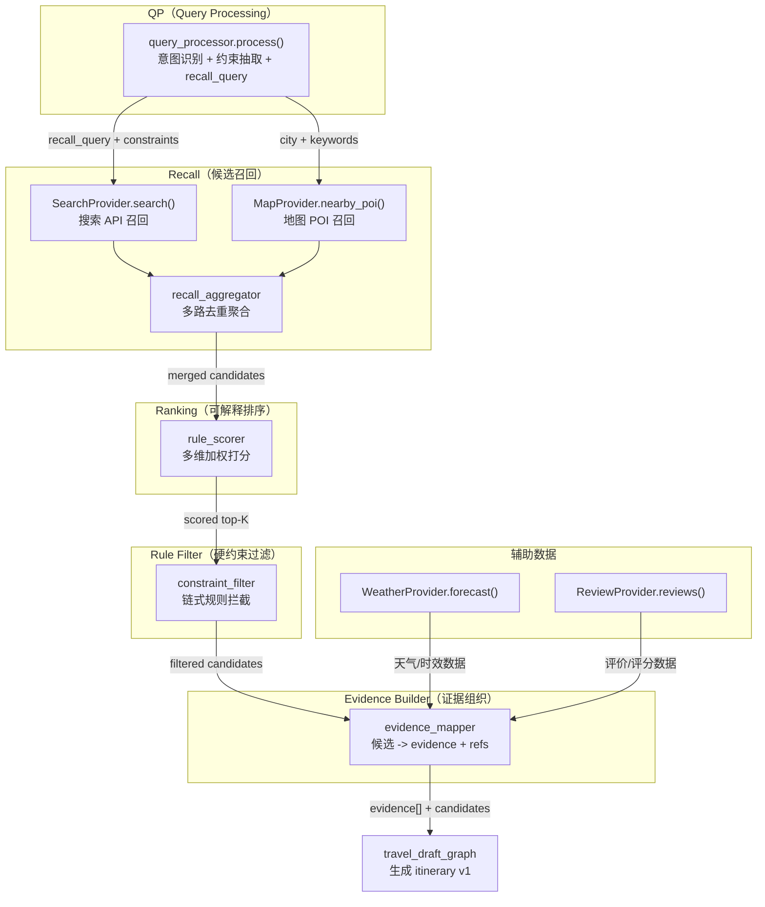
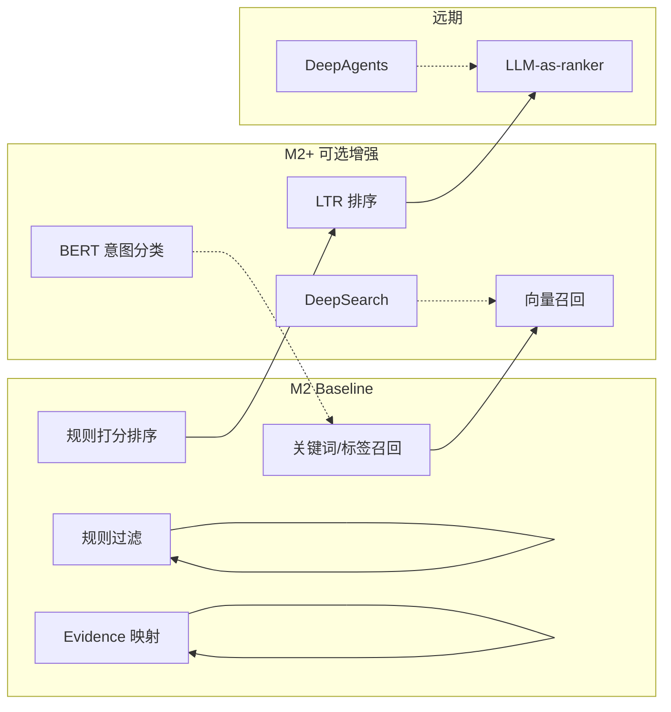

# 下层能力流水线技术方案：QP → 召回 → 排序 → 规则过滤 → 证据组织

> 本文档为 TravelMind 项目「QP-召回-排序」流水线的技术选型探讨与方案设计，对齐 `design.md` 5.3 节与 `task.md` M2-0 任务域。
> 仅作方案记录与面试参考，不涉及具体代码实现。

---

## 一、行业主流方案对比

旅行/本地生活领域的「QP-召回-排序」存在三条主要技术路线，适用场景和工程复杂度差异显著。

### 1.1 OTA/推荐系统路线（飞猪、携程、美团、小红书）

面向**亿级 DAU + 海量自有 POI 库**，走经典漏斗式架构：

| 环节 | 典型技术 | 代表实践 |
|------|----------|----------|
| 召回 | 多路并行：I2I 协同过滤、标签/属性、地理位置、热门、向量双塔 | 飞猪向量召回 V4（旅行状态感知）；小红书 NoteLLM 替代 I2I |
| 粗排 | 轻量模型（双塔/DSSM），从数千压到数百 | 美团粗排双塔 |
| 精排 | 复杂模型（DIN/MMOE/State-MMOE），多目标（CTR+CVR）联合优化 | 美团 MTGR 生成式架构；小红书 RankGPT 自回归精排 |
| 重排 | 多样性打散、业务规则、流量调控 | 各家均有 |

**工程依赖**：自有 POI 库 + 用户行为数据 + GPU 训练集群 + 特征工程平台（RTFS/RTUS）。

**结论**：不适合个人/小团队项目直接复刻——缺少自建数据与训练基础设施。

### 1.2 LLM Agent + Tool Calling 路线（Mindtrip、TravelAgent、开源 Agent 项目）

面向**对话式旅行规划**，与 TravelMind 产品形态一致：

| 环节 | 典型技术 |
|------|----------|
| 召回 | LLM 通过 function calling / tool use 调用外部搜索 API（SerpApi / Google Maps / 高德 / 大众点评），获取实时 POI、酒店、航班等候选 |
| 排序/过滤 | LLM 在 prompt 内做约束匹配与筛选（预算、时间、偏好），或用轻量规则函数做硬约束过滤 |
| 证据 | 搜索结果自带来源 URL、评分、时间，直接映射为 evidence |

**工程依赖**：外部 API 接入 + LLM 推理能力，不需要自建 POI 库和推荐模型。

**结论**：适合个人项目和 MVP，工程复杂度可控。

### 1.3 RAG + Rerank 路线（Agentic RAG、LlamaIndex、LangGraph CRAG）

| 环节 | 典型技术 |
|------|----------|
| 召回 | 向量检索（FAISS / Qdrant）+ 关键词检索混合 |
| Rerank | Cross-Encoder（Cohere Rerank、BGE-Reranker）或 LLM-as-judge |

**适用场景**：基于自有文档/知识库的问答，不是实时 POI 搜索。

**结论**：与旅行规划的实时候选获取需求不匹配，但向量召回可作为后续增强通道。

---

## 二、TravelMind 项目约束与技术路线选择

### 2.1 项目约束分析

| 维度 | TravelMind 现状 |
|------|----------------|
| 产品形态 | 对话式行程规划（对标 Mindtrip / GPT） |
| 控制面 | LangGraph 唯一控制面（`lg_builder.py`） |
| QP | 已实现（`query_processor.py`：意图识别 + 约束抽取 + `recall_query` 生成） |
| Provider 抽象 | 已定义 `SearchProvider` / `MapProvider` / `WeatherProvider` / `ReviewProvider` 接口（`providers/base.py`） |
| POI 数据 | 无自建 POI 库 |
| 用户行为数据 | 无（不做推荐系统级个性化） |
| GPU/训练 | 无 |
| 目标 | 方案合理、能跑通演示、简历可说 |

### 2.2 技术路线决策：LLM Tool Calling + 规则排序/过滤

选择 1.2 路线（LLM Agent + Tool Calling），理由：

1. **无自建 POI 库和用户行为数据**——飞猪/美团那套「向量双塔 + MMOE 精排」无法复刻。
2. **产品形态是对话式规划**（不是 Feeds 流推荐），核心是「约束满足 + 可解释行程」而非 CTR 优化。
3. **LangGraph 已是控制面，Provider 抽象已有**——天然适配 tool calling 模式，无需额外引入编排框架。
4. **规则排序 + 规则过滤在旅行场景下是业界共识**——硬约束（预算/时间/闭馆）优先级高于模型建议（对齐 `design.md` 5.3.4）。
5. **与 Mindtrip / TravelAgent 等 Agent 产品路线一致**——面试时有明确对标。

---

## 三、整体架构设计

### 3.1 流水线全景



### 3.2 流水线在 LangGraph 中的位置

流水线运行在 `travel_draft_graph` 的规划节点内部，由 LangGraph 节点调用，不独立持久化状态（对齐 `design.md` 5.3 节约束）。

数据流向：

```
用户输入
  ↓
澄清服务（hard/soft 门槛）
  ↓ 约束补齐
QP.process() → QPOutput
  ↓ recall_query + constraints
Recall（Search + Map 多路） → ProviderCandidate[]
  ↓ merged candidates
Ranking（rule_scorer） → scored & sorted candidates
  ↓ top-K
Rule Filter（constraint_filter） → filtered candidates + reject reasons
  ↓
Evidence Builder → evidence[] + evidence_refs
  ↓
Draft 节点组装 ItineraryV1 → final_itinerary SSE 输出
```

---

## 四、各环节技术方案

### 4.1 QP（Query Processing）— 已实现，可增强

**现状**（对应 `llm_backend/app/domain/travel/query_processor.py`）：

- 意图识别：`create` / `edit` / `qa` / `reset`，细分 `first_create` / `edit_day` / `qa_evidence` / `qa_local` / `reset_all`
- 约束抽取：`destination_city`、`days`、`budget`、`traveler_type`、`preferences`、`pace`
- `recall_query` 生成：拼接原始查询 + 结构化约束
- 实现方式：规则 baseline（正则 + 关键词匹配 + `qp_rules` 配置）

**QP 输出结构**（`QPOutput`）：

```text
QPOutput:
  intent: IntentType           # create | edit | qa | reset
  intent_detail: IntentDetailType
  normalized_query: str
  recall_query: str            # 供召回环节消费
  constraints: QPConstraints   # 结构化约束
  constraint_presence: dict    # 各约束是否存在
  missing_required: list[str]  # 缺失的硬约束（触发澄清）
```

**增强方向**（M2+ 可选，对齐 `task.md` T-M2-009a）：

| 方向 | 技术 | 说明 |
|------|------|------|
| LLM 约束抽取 | Structured Output（JSON mode） | 更准、支持模糊表述，回退到规则 baseline |
| BERT 意图分类 | 轻量分类模型，可插拔 | 与规则 baseline A/B 对比 |
| Query 改写 | LLM rewrite | 纠错 + 同义扩展，保留设计位 |

**面试说法**：M1 用规则 baseline 保证可控可解释，预留 LLM 抽取接口位，后续可平滑切换。

---

### 4.2 Recall（候选召回）— 核心新增

**推荐方案：外部搜索 API + Provider 抽象 + 多路聚合**

#### 技术选型

| 组件 | 方案 | 对齐代码 |
|------|------|----------|
| SearchProvider | 调用搜索 API（SerpApi / 高德 POI 搜索 / 大众点评） | `SearchProvider.search(query, top_k, context)` |
| MapProvider | 调用地图 POI 周边搜索 API（高德 / 百度地图） | `MapProvider.nearby_poi(city, keywords, top_k, context)` |
| 多路聚合 | 按 `candidate_id`（POI 名 + 城市）去重合并，保留来源标记 | 新增 `recall_aggregator` 模块 |
| 降级 | Provider 不可用时用本地 fixture JSON 降级 | 对齐 `design.md` 7.7 可插拔约束 |

#### 召回输入输出

输入（来自 QP）：
- `recall_query`：自然语言 + 结构化约束拼接
- `constraints.destination_city`：目标城市
- `constraints.preferences`：偏好标签

输出（标准结构，对齐 `providers/base.py`）：

```text
ProviderCandidate:
  candidate_id: str     # POI唯一标识
  source: str           # 来源（search / map / ...）
  title: str            # POI名称
  snippet: str          # 摘要
  score: float          # 来源原始评分
  tags: list[str]       # 标签（类型/风格）
  extra: dict           # 扩展字段（url/address/rating/lat/lng/cost_estimate/...）
```

#### 为什么选这个

1. 与项目已有 Provider 抽象接口完全对齐（`SearchProvider.search()`、`MapProvider.nearby_poi()`）。
2. 不需要自建 POI 库——搜索 API 返回自带 rating / address / url，天然可做排序输入和 evidence 来源。
3. 大厂 Agent 产品（Mindtrip、TravelAgent 论文）走的就是这条路。
4. Mock/fixture 降级路径已在 design 中约束（`design.md` 7.7），离线可跑通主链路。

---

### 4.3 Ranking（可解释排序）— 核心新增

**推荐方案：可解释规则打分（加权求和）**

#### 打分维度与权重（可配置）

| 维度 | 信号来源 | 计算方式 | 说明 |
|------|----------|----------|------|
| `preference_match` | QP `preferences` vs `candidate.tags` | Jaccard 相似度或命中率 | 偏好匹配度 |
| `budget_fit` | QP `budget` vs `candidate.extra.cost_estimate` | 1 - \|差值\| / budget，裁剪到 [0,1] | 预算匹配（越接近越高） |
| `rating` | 搜索 API 返回的评分 | 归一化到 [0, 1] | 口碑质量 |
| `popularity` | 搜索 API 返回的热度/评价数 | 归一化到 [0, 1] | 热度信号 |
| `evidence_quality` | 是否有 url / snippet / rating | 布尔计数归一化 | 证据完整度 |

#### 排序逻辑

```
total_score = Σ (weight_i × score_i)
```

- 取 `top-K` 候选进入过滤环节
- 权重放在配置文件/字典中，支持运行时调整
- 分项得分保留，用于可解释输出和调试

#### 为什么选这个

1. 旅行规划核心是「约束满足 + 可解释」，不是 CTR 优化——规则打分天然可解释。
2. 飞猪/美团那套需要用户行为数据训练，本项目没有行为数据。
3. 规则打分对个人项目来说可控、可调、可解释，面试好说。
4. 对齐 `design.md` 5.3.6 M2 baseline 思路。

#### 演进路径

| 阶段 | 排序策略 | 触发条件 |
|------|----------|----------|
| M2 baseline | 可解释规则打分 | 默认 |
| M2+ 可选 | LTR（Learning-to-Rank） | 有标注数据后 |
| 远期 | LLM-as-ranker | 排序质量瓶颈时 |

---

### 4.4 Rule Filter（规则过滤）— 核心新增

**推荐方案：链式规则过滤器**

#### 过滤规则清单

| 规则 | 输入 | 逻辑 | 输出 |
|------|------|------|------|
| `budget_filter` | 候选费用估算 + QP budget | 单 POI 预估费用 × 天数 > 总预算 → reject | reject + "超出预算" |
| `time_conflict_filter` | 同日同时段候选 | 同一时段多个 POI → reject 低分者 | reject + "时间冲突" |
| `closed_filter` | Weather/Review 返回的营业状态 | 闭馆/停运 → reject | reject + "闭馆/停运" |
| `distance_filter` | 同天 POI 间地理距离 | 距离过远（超阈值）→ reject 或标 risk | reject/risk + "距离过远" |
| `pace_filter` | 同天 POI 数量 + QP pace | POI 数 > 节奏上限 → reject 低分者 | reject + "节奏超载" |

#### 执行策略

- 规则按优先级串行执行（budget → time → closed → distance → pace）。
- 命中即标记 `reject` + `reason`，不短路（所有规则都执行，收集全部 reason）。
- `reason` 回写到 `validation.conflicts[]` 或 `validation.assumptions[]`。
- 过滤后剩余候选不足时，降级放宽阈值并在 `assumptions` 中说明。

#### 为什么选这个

1. `design.md` 5.3.4 明确约束：「规则过滤优先级高于模型建议」。
2. 旅行硬约束（预算/时间/闭馆/距离）本质就是确定性规则，不需要模型。
3. 过滤原因直接对应 itinerary v1 的 `validation.conflicts[]` 和 `assumptions[]`，天然可解释。

---

### 4.5 Evidence Builder（证据组织）— 核心新增

**推荐方案：候选字段映射 + 降级策略**

#### 映射关系

| ProviderCandidate 字段 | itinerary v1 Evidence 字段 | 说明 |
|------------------------|---------------------------|------|
| `candidate.source` | `evidence.provider` | 来源标识 |
| `candidate.extra["url"]` | `evidence.url` | 来源链接 |
| `candidate.title` | `evidence.title` | POI 名称 |
| `candidate.snippet` | `evidence.snippet` | 摘要（截断） |
| 当前时间 | `evidence.fetched_at` | 获取时间 |
| source 标注 | `evidence.attribution` | 归因声明 |

#### 降级策略（对齐 itinerary v1 P1 字段规则）

| 字段缺失 | 降级行为 |
|----------|----------|
| `provider` 缺失 | 写空，追加 `validation.assumptions`："Evidence provider is missing; source reliability cannot be fully graded." |
| `url` 缺失 | 写空，追加 `validation.assumptions`："Evidence URL is missing; traceability is reduced." |
| `fetched_at` 缺失 | 写空，追加 `validation.assumptions`："Evidence recency is unknown; freshness risk should be disclosed." |
| `snippet` 缺失 | 写空，不阻断输出 |

#### evidence_refs 关联

- 每个 `ItinerarySlot` 的 `evidence_refs` 关联对应候选的 `evidence_id`。
- 一个 slot 可关联多个 evidence（同一 POI 可能有 search + review 两个来源）。

---

## 五、与大厂方案对比（面试话术）

### 5.1 对比表

| 对比维度 | 飞猪/美团（OTA 推荐） | TravelMind（Agent 规划） |
|----------|----------------------|------------------------|
| 召回 | 向量双塔 + I2I + 属性 + 热门 | 外部搜索 API（Search / Map Provider） |
| 排序 | DIN / MMOE / 生成式精排 | 可解释规则打分（加权多维） |
| 过滤 | 业务规则 + 多样性打散 | 硬约束规则链（预算/时间/闭馆/距离） |
| 数据 | 自建亿级 POI + 用户行为 | 外部 API 实时获取 |
| 目标 | CTR / CVR 优化 | 约束满足 + 可解释行程 |
| 证据 | 内部数据（不对用户透明） | evidence + refs 透明可追溯 |

### 5.2 推荐话术

**路线选择**：

> 我们的场景是对话式行程规划，不是 Feeds 推荐，核心目标是约束满足与可解释，所以选了 Tool Calling 召回 + 规则打分排序，和 Mindtrip / TravelAgent 等 Agent 产品路线一致。

**技术方案**：

> 召回走 Provider 抽象 + 外部搜索 API，排序用可解释规则打分（偏好/预算/通勤/评分），规则过滤做硬约束拦截（超预算/时间冲突/闭馆），Evidence Builder 把搜索结果映射为证据引用。后续可接向量召回和 LTR，架构预留了切换位。

**与大厂差异**：

> 飞猪/美团走的是经典推荐漏斗（向量双塔 + MMOE 精排），依赖自建 POI 库和用户行为数据。我们没有这些基础，但旅行规划场景的核心需求是硬约束满足而非 CTR，所以规则 baseline 是合理的工程选择。架构上 Provider 接口和排序策略都支持可插拔，后续有数据后可以平滑升级。

---

## 六、演进路线（对齐 design.md 5.3.6）



**原则**（对齐 `design.md` 7.7）：
- 增强能力不得阻塞主链路交付，必须支持开关与回退。
- QP / Ranking 允许 baseline 与模型策略并存，通过配置切换。
- 任一增强失败必须可回退 baseline，主链路不中断。

---

## 七、后续落地建议（仅记录思路）

若进入开发阶段，建议按 `task.md` T-M2-000b ~ 000e 的顺序依次实现：

1. **SearchProvider / MapProvider 具体类**：接外部搜索 API，返回 `ProviderCandidate[]`
2. **多路召回聚合**：去重、来源标记、mock 降级
3. **rule_scorer**：加权打分函数 + 配置化权重
4. **constraint_filter**：硬约束规则过滤链 + 过滤原因标准化
5. **evidence_mapper**：候选 → evidence schema 映射 + 降级策略
6. **接入 travel_draft_graph**：在 LangGraph 节点内串起完整流水线

---

## 附录 A：项目现有相关代码索引

| 模块 | 路径 | 说明 |
|------|------|------|
| Provider 抽象接口 | `llm_backend/app/services/providers/base.py` | `SearchProvider`、`MapProvider`、`WeatherProvider`、`ReviewProvider` 及 `ProviderCandidate`、`ProviderResponse` 定义 |
| QP 实现 | `llm_backend/app/domain/travel/query_processor.py` | `TravelQueryProcessor`：意图识别 + 约束抽取 + recall_query |
| QP 规则配置 | `llm_backend/app/domain/travel/qp_rules.py` | 关键词、正则、偏好列表等配置 |
| 澄清规则 | `llm_backend/app/domain/travel/clarification_rules.py` | 硬/软门槛定义 |
| itinerary v1 Schema | `llm_backend/app/schemas/itinerary_v1.py` | `ItineraryV1`、`EvidenceItem`、`ValidationResult` 等 Pydantic 模型 |
| 旅行规划图 | `llm_backend/app/lg_agent/travel_draft_graph.py` | LangGraph 规划节点，流水线接入点 |

## 附录 B：参考资料

- 飞猪向量召回 V4：旅行状态感知的多路召回架构
- 美团 MTGR：生成式推荐排序架构
- 小红书 NoteLLM / RankGPT：LLM 驱动的召回与排序
- Mindtrip：对话式旅行规划 Agent（Tool Calling + 外部 API）
- TravelAgent（微软研究院论文）：LLM Agent 旅行规划方案
- LangGraph CRAG：Corrective RAG 架构参考
- `design.md` 5.3 节：下层能力流水线设计
- `task.md` M2-0：QP → Recall → Ranking → Rule Filter → Evidence Builder 任务拆解
